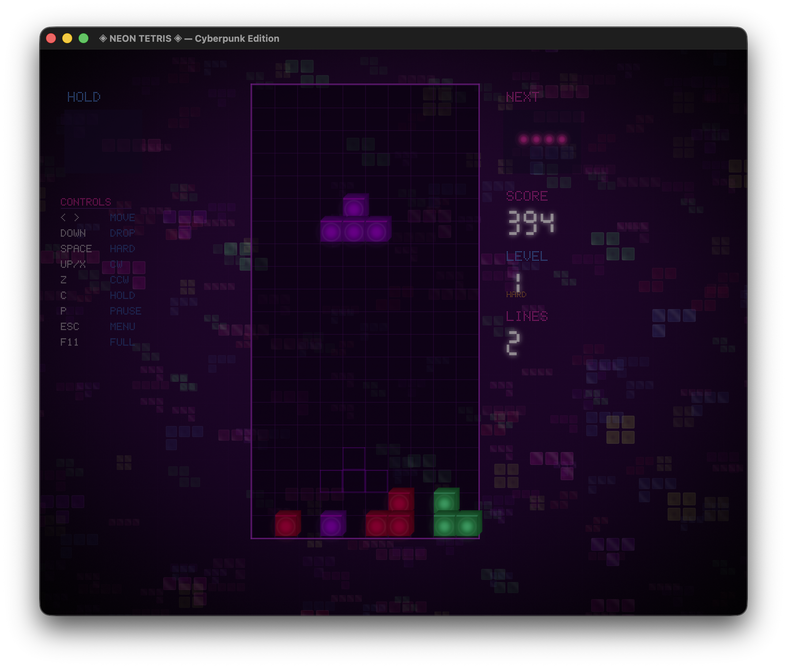
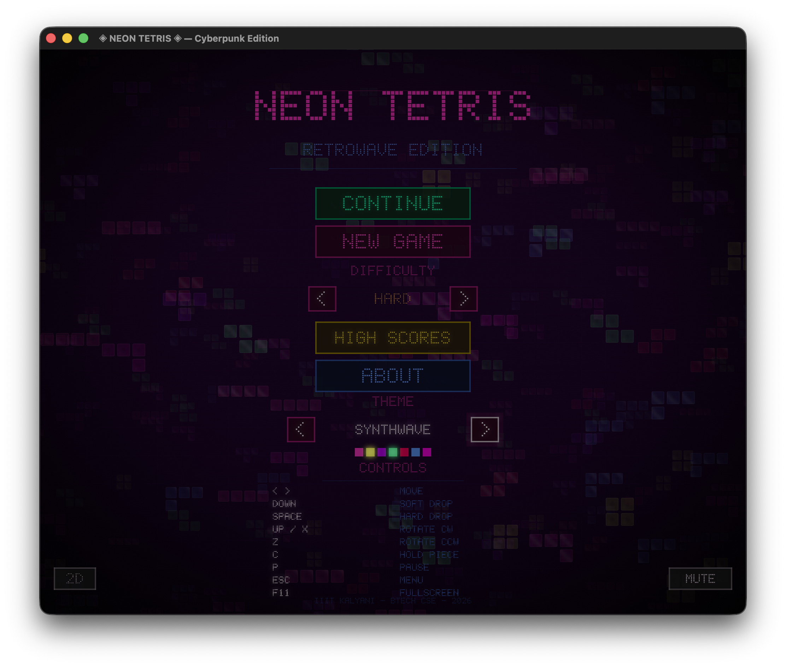
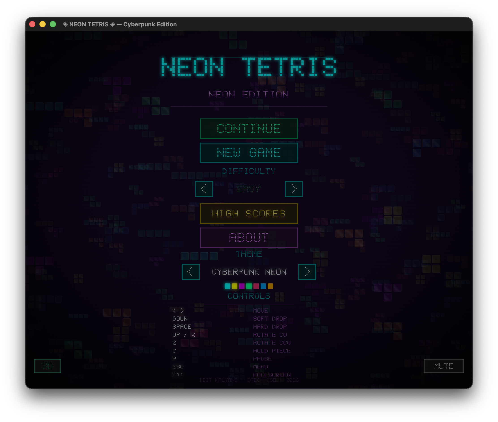
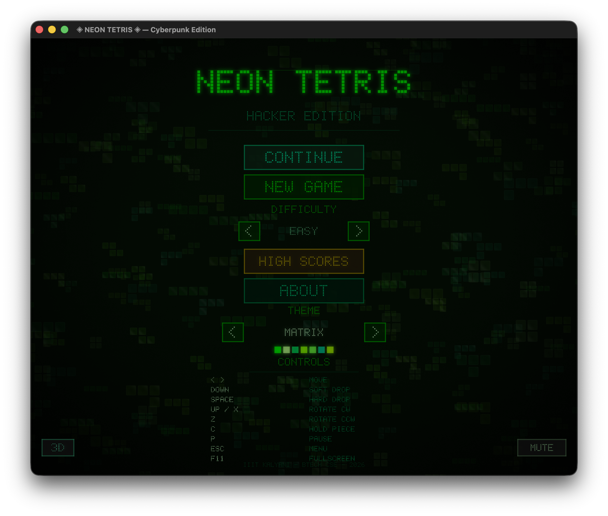
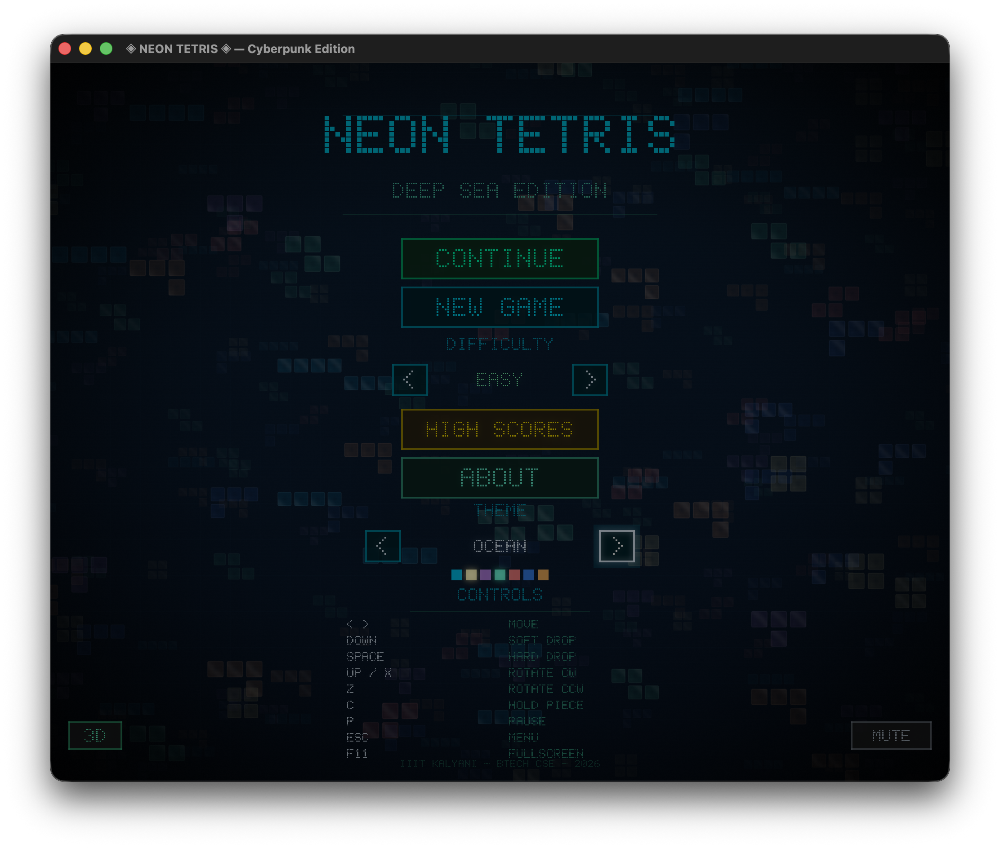
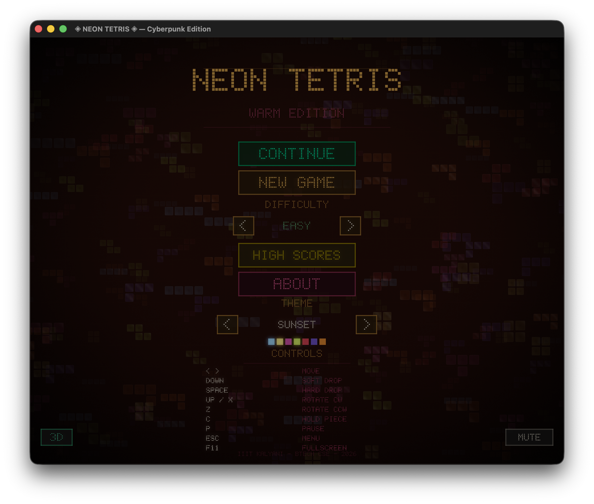
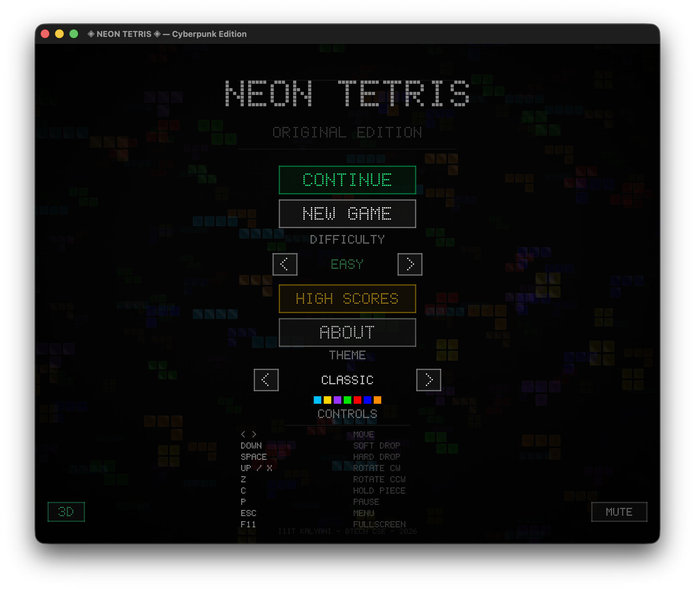
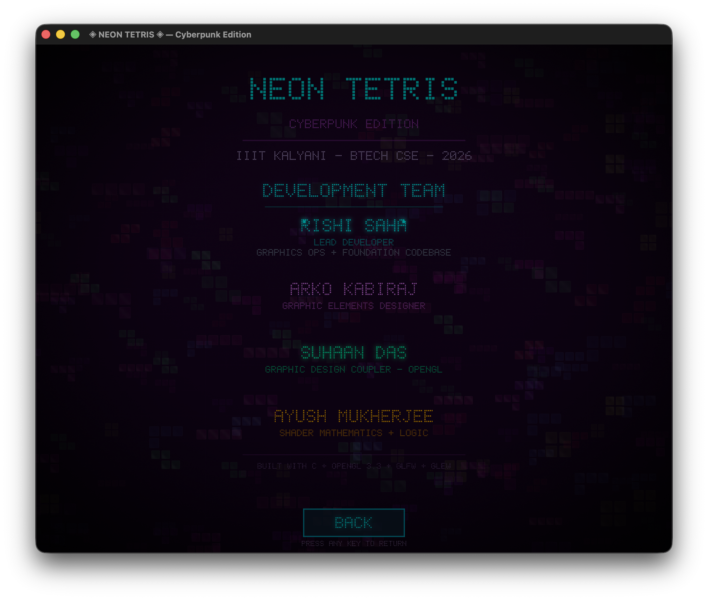

# ◈ NEON TETRIS — Cyberpunk Edition

A visually stunning Tetris game written in **pure C** using **OpenGL 3.3 Core Profile**.


## ✦ Features

- **Neon Glow Shaders** — Custom GLSL fragment shaders with pulsing glow, edge highlights, and bloom
- **Particle System** — Explosive particle effects on line clears and hard drops (up to 2000 particles)
- **Cyberpunk Background** — Animated scrolling grid with CRT scanlines and vignette
- **Ghost Piece** — Transparent outline showing where the piece will land
- **Hold System** — Press C to hold a piece for later use
- **Next Piece Preview** — See what's coming next
- **Combo Scoring** — Consecutive line clears multiply your score
- **Level Progression** — Speed increases every 10 lines
- **Screen Shake** — Juicy feedback on hard drops and line clears
- **DAS/ARR** — Proper Delayed Auto Shift for smooth horizontal movement
- **Lock Delay** — Brief grace period before pieces lock, allowing last-second moves

## ✦ Screenshots

### Gameplay
<p align="center">
  
</p>

### Themes
<p align="center">
  
  
</p>
<p align="center">
  
  
</p>
<p align="center">
  
  
</p>

### About
<p align="center">
  
</p>

## ✦ Requirements

- GCC (or any C11 compiler)
- OpenGL 3.3+ capable GPU
- GLFW 3.x
- GLEW
- OpenAL

## ✦ Installation

### Ubuntu / Debian
```bash
sudo apt-get install -y libglfw3-dev libglew-dev libgl-dev build-essential
```

### Fedora
```bash
sudo dnf install -y glfw-devel glew-devel mesa-libGL-devel gcc make
```

### Arch Linux
```bash
sudo pacman -S glfw-x11 glew mesa gcc make
```

### macOS (Homebrew)
```bash
brew install glfw glew
```

### Windows (MSYS2)
Install [MSYS2](https://www.msys2.org/), then open the **MINGW64** shell and run:
```bash
pacman -S mingw-w64-x86_64-gcc mingw-w64-x86_64-glfw mingw-w64-x86_64-glew mingw-w64-x86_64-openal
```

## ✦ Build & Run

```bash
make
./neon_tetris
```

Or in one step:
```bash
make run
```

## ✦ Controls

| Key         | Action              |
|-------------|---------------------|
| ← →         | Move piece          |
| ↓           | Soft drop           |
| Space       | Hard drop           |
| ↑ / X       | Rotate clockwise    |
| Z           | Rotate counter-CW   |
| C           | Hold piece          |
| P           | Pause               |
| R           | Restart (game over) |
| Escape      | Quit                |

## ✦ Scoring

| Action            | Points                |
|-------------------|-----------------------|
| Soft drop         | 1 per cell            |
| Hard drop         | 2 per cell            |
| Single line       | 100 × level           |
| Double            | 300 × level           |
| Triple            | 500 × level           |
| Tetris (4 lines)  | 800 × level           |
| Combo bonus       | +50 × combo × level   |

## ✦ Architecture

```
tetris/
├── include/
│   ├── tetris.h        # All structures, constants, declarations
│   └── shaders.h       # GLSL shader source strings
├── src/
│   └── main.c          # Game logic, rendering, input, particles
├── Makefile
└── README.md
```

### Rendering Pipeline
1. **Background Pass** — Full-screen quad with animated cyberpunk grid shader
2. **Grid Pass** — Board outline and grid lines
3. **Ghost Piece** — Translucent outline at landing position
4. **Locked Blocks** — Glow shader on all placed blocks
5. **Current Piece** — Active piece with enhanced glow
6. **Particles** — Additive blended particle system
7. **UI** — Score, level, next/hold pieces, overlays

### Shader System
- **Basic Shader** — Flat colored quads for grid, UI elements
- **Glow Shader** — Distance-field based neon glow with scanline effect
- **Particle Shader** — Soft radial gradient with additive blending
- **Background Shader** — Procedural animated cyberpunk grid

## ✦ Project Info

| # | Name | Role |
|:-:|------|------|
| 0 | **Rishi Saha** | Lead Developer |
| 1 | **Arko Kabiraj** | Graphic Designer |
| 2 | **Suhaan Das** | Graphic Design Coupler (OpenGL) |
| 3 | **Ayush Mukherjee** | Shader Mathematics & Logic |

> **IIIT Kalyani** — BTech CSE, 2026

### Lines of Code Contribution

**Rishi Saha** — Lead Developer
| File | Lines | Section |
|------|------:|---------|
| `src/main.c` | 1–26 | Header, includes, global state |
| `src/main.c` | 185–200 | Difficulty settings |
| `src/main.c` | 638–658 | Mouse input callbacks |
| `src/main.c` | 709–928 | Cross-platform helpers, save/load, high scores, config |
| `src/main.c` | 930–965 | Game init, piece spawning setup |
| `src/main.c` | 967–1171 | Core game logic (collision, rotation, hold, hard drop, line clearing) |
| `src/main.c` | 1244–1546 | Game update loop, DAS/ARR, input handling |
| `src/main.c` | 1968–2034 | Game over overlay |
| `src/main.c` | 2036–2120 | Pause overlay |
| `src/main.c` | 2842–2911 | Main function and game loop |
| `include/tetris.h` | 1–368 | All struct/type definitions, constants, function declarations |
| `include/sound.h` | 1–365 | Entire 8-bit audio engine (OpenAL, DSP, SFX generation) |
| `Makefile` | 1–73 | Cross-platform build system |
| **Total** | **~2050** | |

**Arko Kabiraj** — Graphic Designer
| File | Lines | Section |
|------|------:|---------|
| `src/main.c` | 27–173 | Theme definitions (10 color palettes, piece colors, UI styling) |
| `src/main.c` | 522–636 | Pixel font system (5x7 bitmap glyphs, text rendering) |
| `src/main.c` | 660–707 | Button system (hover glow, click feedback) |
| `src/main.c` | 1832–2034 | UI rendering (score, next/hold, controls panel, game over screen) |
| `src/main.c` | 2121–2360 | Menu screen layout |
| `src/main.c` | 2361–2452 | High scores screen |
| `src/main.c` | 2453–2841 | About screen (team credits layout) |
| **Total** | **~1250** | |

**Suhaan Das** — Graphic Design Coupler (OpenGL)
| File | Lines | Section |
|------|------:|---------|
| `src/main.c` | 284–446 | Window init, renderer init (VAO/VBO, shader compilation, FBO setup, bloom pipeline) |
| `src/main.c` | 448–520 | Viewport/resize handling, FBO rebuilding |
| `src/main.c` | 1548–1676 | Rendering helpers (`draw_quad`, `draw_glow_block`, `draw_block_3d`, background render) |
| `src/main.c` | 1678–1830 | Grid rendering, locked blocks, ghost piece, current piece, particles, mini piece |
| `src/main.c` | 1836–1873 | 7-segment digit renderer |
| **Total** | **~650** | |

**Ayush Mukherjee** — Shader Mathematics & Logic
| File | Lines | Section |
|------|------:|---------|
| `src/main.c` | 201–240 | Matrix math utilities (identity, ortho, translate, scale, model) |
| `src/main.c` | 242–283 | Shader compilation pipeline |
| `src/main.c` | 1191–1242 | Particle system physics (spawn, gravity, lifetime decay) |
| `include/shaders.h` | 1–335 | All GLSL shaders (basic, glow with distance-field neon + scanlines, particle, background with procedural grid + falling tetrominos + 3D extrusion + vignette + CRT, bloom bright pass, Gaussian blur, composite with tone mapping) |
| **Total** | **~470** | |

---
